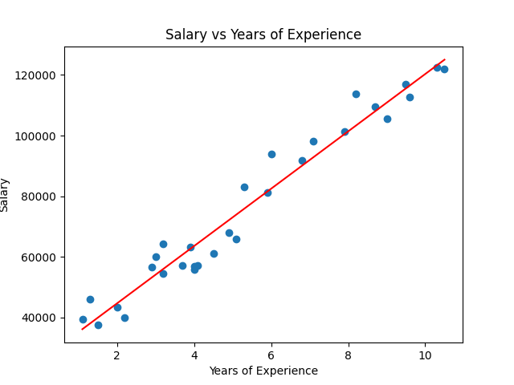

# Linear Regression from Scratch

Implementation of univariate linear regression using gradient descent — built from first principles in NumPy/PyTorch, no sklearn.

## What this does

Trains a linear model `f(x) = wx + b` on a salary-vs-experience dataset by minimising mean squared error using gradient descent. Every component — the cost function, gradient computation, and parameter update loop — is written manually to make the mechanics explicit.

## How it works

**Model:** `f(x) = wx + b`

**Cost function (MSE):**

$$J(w, b) = \frac{1}{2m} \sum_{i=1}^{m} (f(x^{(i)}) - y^{(i)})^2$$

**Gradient update rule:**

$$w := w - \alpha \frac{\partial J}{\partial w}, \quad b := b - \alpha \frac{\partial J}{\partial b}$$

where the partial derivatives are:

$$\frac{\partial J}{\partial w} = \frac{1}{m} \sum_{i=1}^{m} (f(x^{(i)}) - y^{(i)}) \cdot x^{(i)}$$

$$\frac{\partial J}{\partial b} = \frac{1}{m} \sum_{i=1}^{m} (f(x^{(i)}) - y^{(i)})$$

## Project structure

```
linear-regression/
├── Linear_Regression.ipynb   # Main notebook
├── training_set.csv          # Salary vs years of experience dataset
└── README.md
```

## Setup

```bash
conda create -n ml-2026 python=3.10
conda activate ml-2026
pip install numpy pandas matplotlib jupyter
jupyter notebook Linear_Regression.ipynb
```

## Hyperparameters

| Parameter     | Value  |
|---------------|--------|
| Learning rate | 0.01   |
| Iterations    | 10,000 |
| Init w, b     | 0, 0   |

## Results

The model learns a regression line from scratch through gradient descent and plots it over the training data.



## Key implementation decisions

- **No vectorisation** — loops are intentional. The goal is to see each step of the computation, not optimise runtime.
- **Pure NumPy** — no sklearn or autograd. The gradient is derived and coded by hand.
- **Cost printed every 1,000 iterations** — so you can verify the loss is decreasing monotonically.

## What I learned

- How the chain rule produces the gradient update rules for `w` and `b`
- Why the learning rate needs to be small enough that cost decreases on every step
- The relationship between the cost surface and the parameter trajectory during training

## Next steps

- Vectorise using NumPy matrix operations and compare runtime
- Extend to multiple features (multivariate linear regression)
- Implement using PyTorch autograd and compare parameter convergence